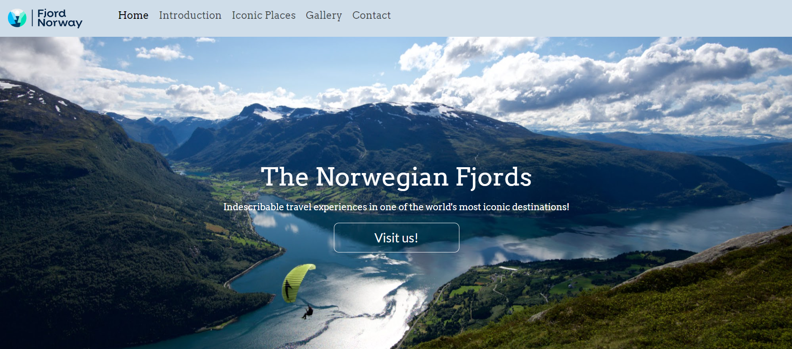
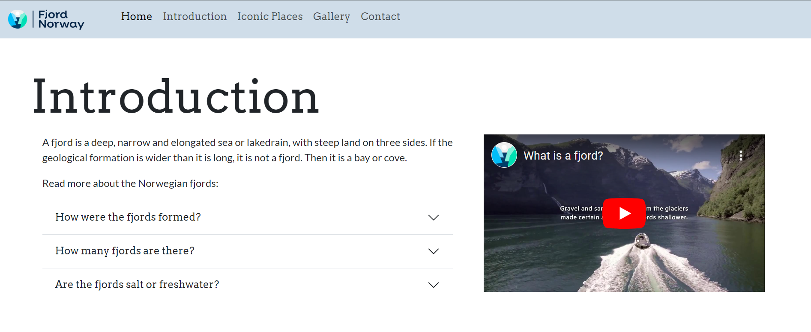
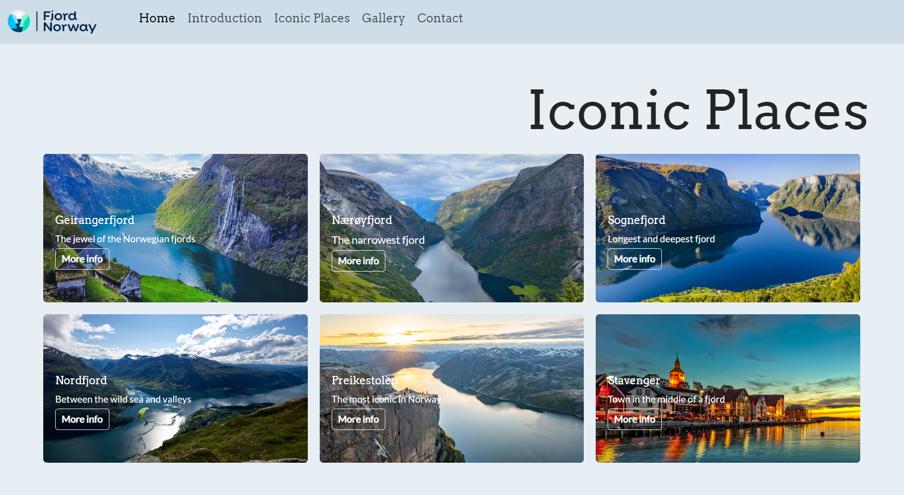
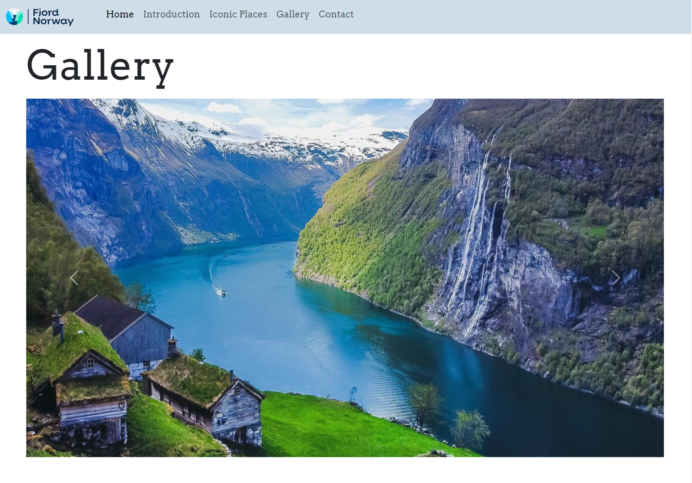
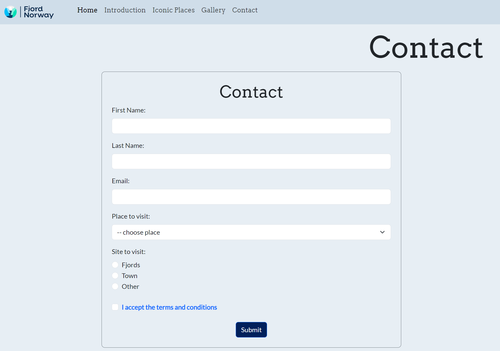
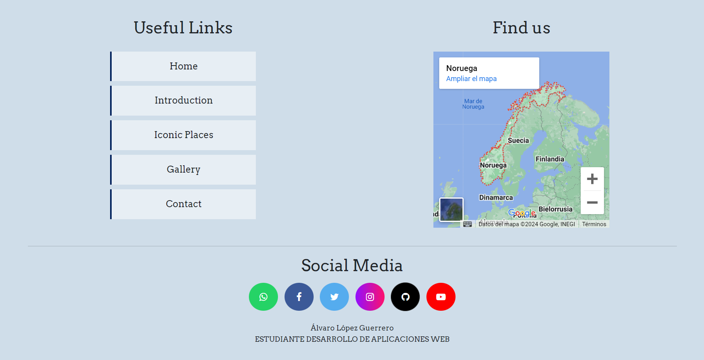
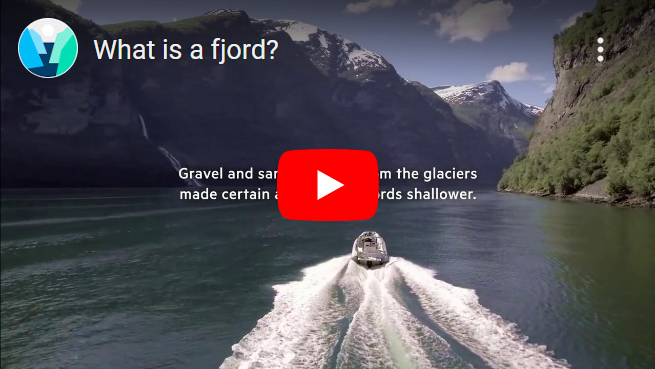

<h1>Memoria del proyecto con bootstrap de Lenguajes de Marcas - 1º DAW</h1>
<h2>The Norwegian Fjords</h2>
<h2>Table of Contents</h2>
<ul>
  <li><a href="#introduccion">Introduction</a></li>
  <li><a href="#motivacion">Motivation</a></li>
  <li><a href="#estructura">Structure</a></li>
  <li><a href="#estilo">Style</a></li>
</ul>

<h2 id="introduccion">Introduction</h2>

Work done by: Álvaro López Guerrero

Website proyect "from scratch" of 2st evaluation of "Lenguajes de Marcas"

February 2024 

License  CC-BY

<h2 id="motivacion">Motivation</h2>

I have selected this topic because in the furture I am going to travel to the Norwegian Fjords, and I love the nature and environment from this place.

<h2 id="estructura">Structure</h2>

The website is divided into 6 sections:

<ul>
  <li>Hero Section</li>  
  <li>Introduction</li>
  <li>Iconic Places</li>
  <li>Gallery</li>
  <li>Contact</li>
  <li>Footer</li>
</ul>

<h3>Hero Section</h3>

The section is composed by a background image, being responsive. 
On it I have placed the title of the page and a Call of Action button styled from bootstrap.

<h3>Introduction</h3>

I have arranged in a grid of 2 columns, a brief introduction to the Norwegian Fjords with and accordion from bootstrap which contains more extra information, and accompanying this in the other column, I have placed a video about the definition of a fjord, from youtube.

<h3>Iconic Places</h3>

In this section I have implemented a grid with 3 columns, where the content is in cards. 
Within the cards we can find an image of each places, a brief description of the place and a button with a link to more information from an external page.

<h3>Gallery</h3>

This section is composed by automatic slideshow gallery of pictures. 
The section are styled as carousel from bootstrap.

<h3>Contact</h3>

This section is composed by form of contact.

<h3>Footer</h3>

The footer is composed of a grid of 2 columns where we find the map with locate the place. 
In the other column the links to text of the page itself. 
And finally below this I have placed the social networks of Visit Norway and mine.

<h2 id="estilo">Site style</h2>
<h3>Color Palette</h3>
<ul>
  <li>#00205B</li>  
  <li>#9fbad3</li>  
  <li>#b7cbde</li>
  <li>#cfdde9</li>
  <li>#e7eef4</li>
  <li>#ffffff</li>
</ul>

<h3>Fonts</h3>

For the titles: Arvo Regular.

For the body text: Lato Regular.

<h3>Videos</h3>
<a href="https://www.youtube.com/embed/rJrVP43MZYI?si=WOnQVPKj8l079V2F" target="_blank"><a/>
